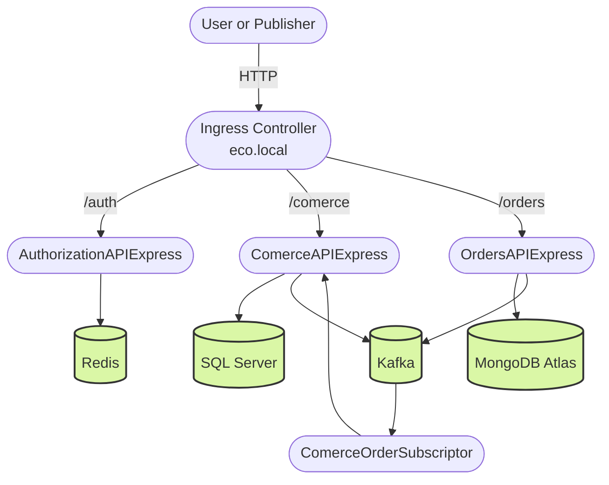

# Table of Contents

* [Introduction](#ecosystem_express)
* [Customer & Provider Registration](#pub_persons)
* [Orders – Customer Online Shopping](#pub_orders)
* [Products – Inventory](#pub_product)
* [Customer & Provider API](#comerceapiexpress)
* [Orders API](#ordersapiexpress)
* [Kafka & Docker](#kafka-docker-images)
* [NGINX](#nginx-docker-image)
* [Redis](#redis-docker-image)

## Ecosystem Express



Demo of a microservices ecosystem interconnected using Domain-Driven Design (DDD), Clean Architecture, and CQRS.
Transactions between microservices are handled using Event Sourcing with Kafka.

## pub\_persons

This is a TypeScript cron-job service that randomly generates fake customers and providers.

1. Generate random persons
2. Each generated person or provider is sent to `ComerceAPIExpress` for creation in SQL Server:

   * `POST http://[host]:[port]/api/persons/customers`
   * `POST http://[host]:[port]/api/persons/providers`

## pub\_product

This is a TypeScript cron-job service that randomly generates and simulates products being added to the warehouse.

The service calls the `ComerceAPIExpress` backend to create or insert products into SQL Server:

* `POST http://[host]/api/products/`

**Auth**: This service obtains authentication tokens through the `AuthorizationAPIExpress` API, which issues a JWT and refresh token using a simple asymmetric key authentication process.

## pub\_orders

This is a TypeScript cron-job service that randomly generates fake customer orders to simulate online shopping behavior.

To get product and customer data, this service interacts with `ComerceAPIExpress`.

* `GET http://[host]:[port]/api/orders/`

Then it sends the orders to the `OrdersAPIExpress` backend to store them in MongoDB:

* `POST http://[ordersHost]:[port]/api/orders/`

## ComerceOrderSubscriber

This is a TypeScript cron-job service that continuously listens to the Kafka topic `[Orders]`.

Each order received is automatically sent to `ComerceAPIExpress` using the following endpoint:

* `POST http://[host]:[port]/api/orders/`

Note: In this API, the orders will be stored in SQL Server (they were originally stored in MongoDB and in the Kafka event bus).

## ComerceAPIExpress

This is the commerce backend. It's an Express + TypeScript API that supports CRUD operations for customers, providers, and products.

The publisher services `pub_product` and `pub_persons` use this API to perform create operations.

It also emits events to the event source (Kafka) on every insert.

* `POST http://[comerceHost]:[port]//api/orders/`

## OrdersAPIExpress

This is the orders backend. It's an Express + TypeScript API that supports CRUD operations for orders.

The API interacts with MongoDB Atlas to store all orders and emits an event to the event source for every insert.

* Kafka Topic: `Orders`

## AuthorizationAPIExpress

This API is responsible for authenticating other apps that call resource APIs such as `ComerceAPIExpress` and `OrdersAPIExpress`.

* `POST http://[AuthHost]:[port]/api/sec/authenticate`

The authorization mechanism uses Redis to store a token blacklist and to manage token revocation.

# Deploying Components with Docker

First, navigate to the folder of each component. Each one contains a `Dockerfile` and a `docker-compose.yml` file.

These files allow you to build and deploy the Docker images and containers for each API and third-party service such as Redis and Kafka.

> ⚠️ Note: In this example, MongoDB is not deployed locally because we are using a free Atlas cloud account: [https://cloud.mongodb.com](https://cloud.mongodb.com)

### Build and Deploy APIs

```bash
cd D:\Ecosystem\AuthorizationAPIExpress

docker image build -t moviedomfo/eco-api-auth .
docker-compose up -d
```

```bash
cd D:\Ecosystem\OrdersAPIExpress

docker image build -t moviedomfo/eco-api-orders .
docker-compose up -d
```

```bash
cd D:\Ecosystem\ComerceAPIExpress

docker image build -t moviedomfo/eco-api-comerce .
docker-compose up -d
```

### Summary – Build All Images

```bash
docker image build -t moviedomfo/eco-api-auth .
docker image build -t moviedomfo/eco-api-orders .
docker image build -t moviedomfo/eco-api-comerce .
```

## Implementing Kafka as Event Sourcing

### Kafka Docker Images

Apache Kafka is a distributed streaming platform used to build real-time data pipelines and applications. It can function as a message broker or a log aggregator.

We use the Bitnami-packaged version of Apache Kafka.

## Running the Application with Docker Compose

We use `docker-compose-kafka.yml`. To run it in the background:

```bash
docker-compose up -d
docker-compose -f docker-compose-kafka.yml up -d
```

To stop and remove all running containers and networks:

```bash
docker-compose down
# or, to also remove volumes
docker-compose down -v
```

## NGINX Docker Image

To start the load balancer and reverse proxy for our APIs:

```bash
docker-compose -f docker-compose-nginx.yml up -d
```

In the configuration file (`docker-compose-nginx.yml`), we define:

1. **Load Balancer for ComerceAPIExpress**:

   * We create two containers: `platon` and `hercules`.
   * These are configured in the `upstream back` section:

     ```nginx
     upstream back {
       server platon:INT_PORT;
       server hercules:INT_PORT;
     }
     ```

   * Requests like `http://localhost:6001/api/persons/` will be routed to either `platon` or `hercules`.

2. **Reverse Proxy for These Services**:

   * `http://localhost:6001/platon/api/persons/`
   * `http://localhost:6001/hercules/api/persons/`

3. **Reverse Proxy for OrdersAPIExpress**:

   * `http://localhost:6001/ulises/api/customers/`
   * `http://localhost:6001/platon/api/customers/`

## Redis Docker Image

To enable token caching and blacklisting, the ecosystem uses Redis Cache.

To deploy Redis using Docker Compose:

```bash
docker-compose -f docker-compose-redis.yml up -d
```

Make sure to run this command from the root directory where `docker-compose-redis.yml` is located.
